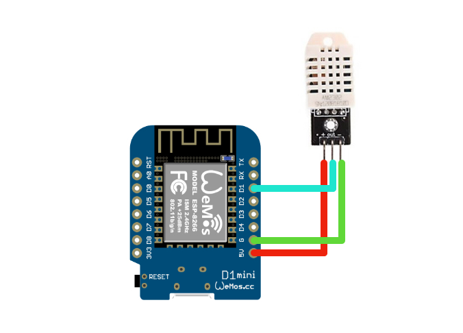
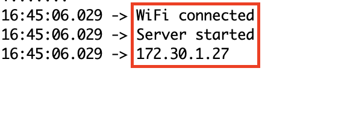
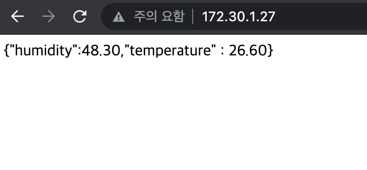

# How to set ESP8266

## Circuit


## Upload Sketch
1. Set your wifi info in 10, 11 line
```
#define STASSID "YOUR-WiFi-SSID"
#define STAPSK "YOUR-WiFi-PASSWORD"
```

2. Set your pin number in 14 line
```
#define PIN 5
```

3. Upload sketch

4. Check the serial monitor to get your local IP.



5. Use your browser to access the Local IP to verify status.

